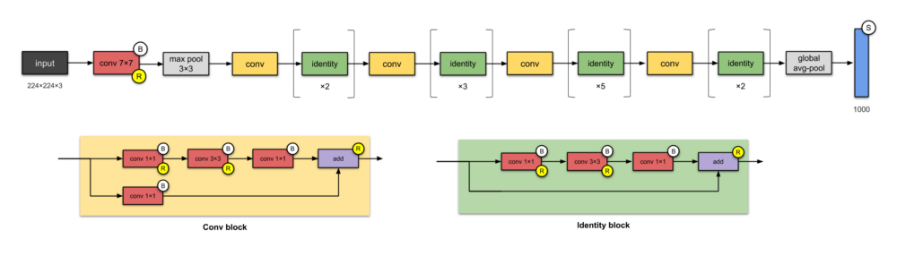
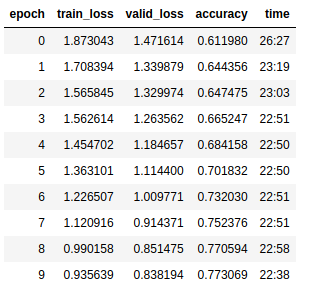
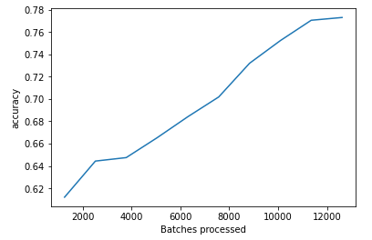
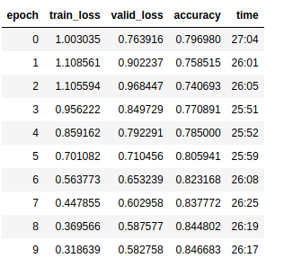
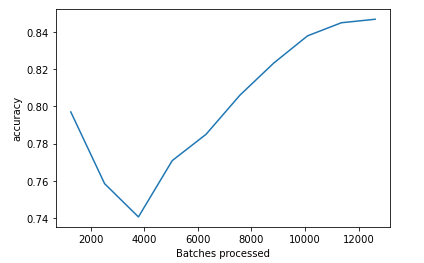
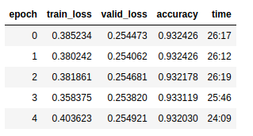
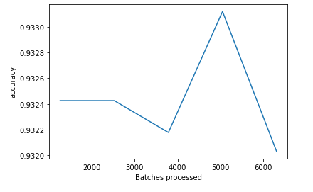
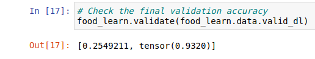
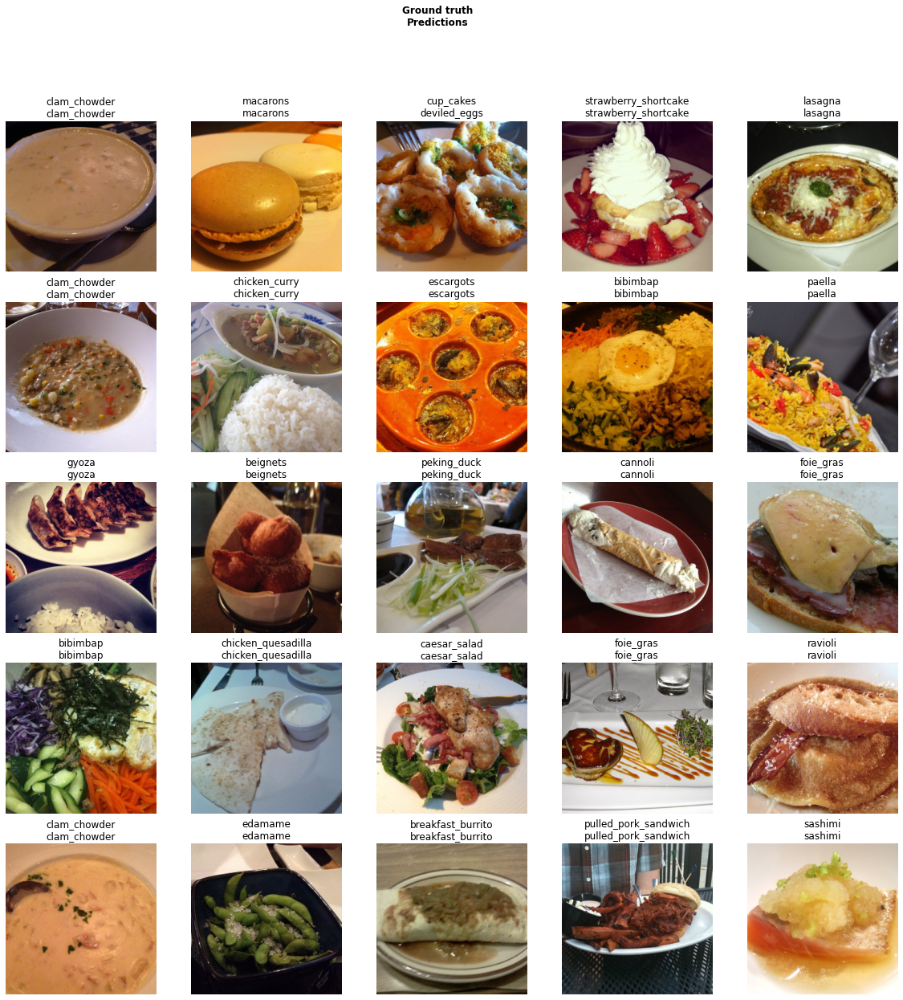

# Food-101 Challenge

[Food-101](https://data.vision.ee.ethz.ch/cvl/datasets_extra/food-101/static/bossard_eccv14_food-101.pdf) is a challenging vision problem, but everyone can relate to it. Recent SoTA is ~90% top-1. These approaches rely on lots of TTA, large networks and even novel architectures.


**Objective :**
Train a decent model >85% accuracy for top-1 for the test set, using a ResNet50 or smaller network with a reasonable set of augmentations.

We will be using Fast AI library which is built on top of PyTorch.


## Current State of the Art Models

 The previous and current SoTA classification results for the Food-101 dataset are as follow :

-   **InceptionV3: 88.28% Top-1 Accuracy**  with unknown-crops.  [Hassannejad, Hamid, et al. "Food Image Recognition Using Very Deep Convolutional Networks." Proceedings of the 2nd International Workshop on Multimedia Assisted Dietary Management. ACM, 2016.](http://dl.acm.org/citation.cfm?id=2986042)
-   **ResNet200: 90.14% Top-1 Accuracy**  on the Food-101 dataset augmented with 19 Korean dishes.  [NVIDIA DEEP LEARNING CONTEST 2016, Keun-dong Lee, DaUn Jeong, Seungjae Lee, Hyung Kwan Son (ETRI VisualBrowsing Team), Oct.7, 2016.](https://www.gputechconf.co.kr/assets/files/presentations/2-1650-1710_DL_Contest_%EC%A7%80%EC%A0%95%EC%A3%BC%EC%A0%9C_%EB%8C%80%EC%83%81.pdf)
-   **WISeR: 90.27% Top-1 Accuracy**  with 10-crops.  [Martinel, Niki, Gian Luca Foresti, and Christian Micheloni. "Wide-Slice Residual Networks for Food Recognition." arXiv preprint arXiv:1612.06543 (2016).](https://arxiv.org/pdf/1612.06543.pdf)

-   **ResNet50 + fastai: 90.52% Top-1 Accuracy**  with Test time augmentations.  [Food-101 SoTA with fastai and platform.ai’s fast augmentation search](https://platform.ai/blog/page/3/new-food-101-sota-with-fastai-and-platform-ais-fast-augmentation-search/)


## Implementation

We used Transfer Learning approach by using ResNet-50 for solving this problem.


Source : https://towardsdatascience.com/illustrated-10-cnn-architectures-95d78ace614d


```python
# Defining the CNN Model

food_learn = cnn_learner(
    data,
    models.resnet50,  # Resnet 50 architechture
    metrics=accuracy,
    wd=1e-1,         # weight decay
)

```


You can see the notebook which has explanations here:

- [Food-101-Challenge Notebook (nbviewer)](https://nbviewer.jupyter.org/github/Eklavya42/food-101-challenge/blob/master/food-101-challenge.ipynb)

- [Food-101-Challenge Notebook (Jovian.ml)](https://jovian.ml/eklavya42/food-101-merged)

---

Note: The training for the model was performed in Kaggle Notebooks in parts (due to time limit for session). The notebooks are now publicly available below:

-   [Kaggle Food-101-Challenge Part-1](https://jovian.ml/outlink?url=https%3A%2F%2Fwww.kaggle.com%2Feklavya18%2Ffood-101-challenge)
-   [Kaggle Food-101-Challenge Part-2](https://jovian.ml/outlink?url=https%3A%2F%2Fwww.kaggle.com%2Feklavya18%2Ffood-101-challenge-part2)
-   [Kaggle Food-101-Challenge Part-3](https://jovian.ml/outlink?url=https%3A%2F%2Fwww.kaggle.com%2Feklavyachopra%2Ffood-101-challenge-part3)

This notebook is the merged part of the above notebooks so that the work is organised.

---


## Result

The results are as follow:

### Stage - 1 :  Pre-trained ResNet50 on Imagenet with Freezed Layers

```python
# learning rate
lr = 1e-2

# Train with 1 cycle policy
food_learn.fit_one_cycle(10, slice(lr))

# save the model
food_learn.save('256_stage1', return_path=True)

```

Results of Epochs for Stage 1




Accuracy Plot for  Stage 1




### Stage - 2 :  Continue the same Model with unfreezed Layers

```python
food_learn = cnn_learner(data, models.resnet50,  metrics=accuracy, wd=1e-1,model_dir='/kaggle/working')

food_learn.load("/kaggle/input/model1/256_stage1")

food_learn.unfreeze()

lr = 1e-2

# Train with 1 cycle policy
food_learn.fit_one_cycle(10, slice(1e-5, lr/5))

# Save the model
food_learn.save("256_stage2", return_path=True)

```

Results of Epochs for Stage 2




Accuracy Plot for  Stage 2




### Stage - 2 :  Continue Model with unfreezed layers for more epochs

```python
food_learn = cnn_learner(data, models.resnet50,  metrics=accuracy, wd=1e-1,model_dir='/kaggle/working')

food_learn.load("/kaggle/input/model1/256_stage2")

food_learn.unfreeze()

lr = 1e-2

# Train with 1 cycle policy
food_learn.fit_one_cycle(5, slice(1e-6))

food_learn.save("256_stage3", return_path=True)

```

Results of Epochs for Stage 3




Accuracy Plot for  Stage 3




### Final Loss and  Accuracy




## Visualising the Results




## Refrences

1. fastai. (2020). Retrieved 19 July 2020, from https://docs.fast.ai/

2. [Bossard, L., Guillaumin, M., & Van Gool, L. (2014, September). Food-101–mining discriminative components with random forests. In European conference on computer vision (pp. 446-461). Springer, Cham.](https://data.vision.ee.ethz.ch/cvl/datasets_extra/food-101/static/bossard_eccv14_food-101.pdf)
3. [Hassannejad, H., Matrella, G., Ciampolini, P., De Munari, I., Mordonini, M., & Cagnoni, S. (2016, October). Food image recognition using very deep convolutional networks. In Proceedings of the 2nd International Workshop on Multimedia Assisted Dietary Management (pp. 41-49).](https://dl.acm.org/doi/10.1145/2986035.2986042)
4. [Keun-dong Lee, DaUn Jeong, Seungjae Lee, Hyung Kwan Son (ETRI VisualBrowsing Team),NVIDIA DEEP LEARNING CONTEST 2016, Oct.7, 2016.](https://www.gputechconf.co.kr/assets/files/presentations/2-1650-1710_DL_Contest_%EC%A7%80%EC%A0%95%EC%A3%BC%EC%A0%9C_%EB%8C%80%EC%83%81.pdf)
5. [Martinel, N., Foresti, G. L., & Micheloni, C. (2018, March). Wide-slice residual networks for food recognition. In 2018 IEEE Winter Conference on Applications of Computer Vision (WACV) (pp. 567-576). IEEE.](https://arxiv.org/pdf/1612.06543.pdf)
6. Navruzyan, A. (2019). New Food-101 SoTA with fastai and platform.ai’s fast augmentation search. Retrieved 19 July 2020, from https://platform.ai/blog/page/3/new-food-101-sota-with-fastai-and-platform-ais-fast-augmentation-search/
7. Setting the learning rate of your neural network. (2018). Retrieved 19 July 2020, from https://www.jeremyjordan.me/nn-learning-rate/
8. [Smith, L. N. (2018). A disciplined approach to neural network hyper-parameters: Part 1--learning rate, batch size, momentum, and weight decay. arXiv preprint arXiv:1803.09820.](https://arxiv.org/pdf/1803.09820.pdf)
9. Gugger, S. (2018). The 1cycle policy. Retrieved 19 July 2020, from https://sgugger.github.io/the-1cycle-policy.html
10. Validation Error less than training error?. Retrieved 19 July 2020, from https://stats.stackexchange.com/questions/187335/validation-error-less-than-training-error


**Blog Coming Soon**
